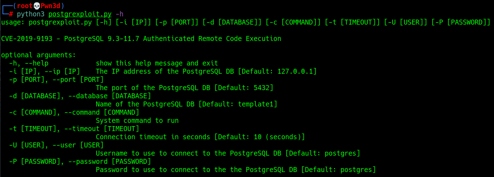
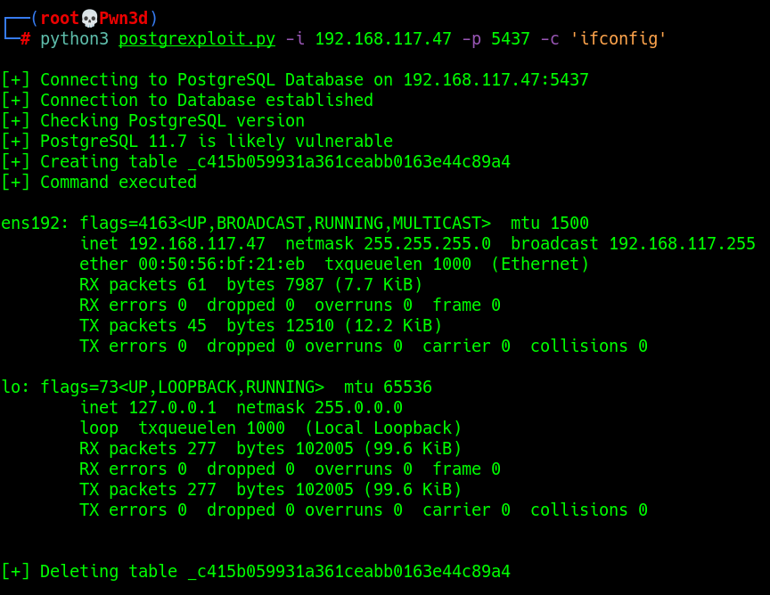

# CVE-2019–9193 - PostgreSQL 9.3-12.3 Authenticated Remote Code Execution

## Proof of Concept

PostgreSQL Database from version 9.3 to 12.3 (latest tested) are vulnerable to Authenticated Remote Code Execution. 
Even if it isn't considered to be a vulnerability itself by the development team, this could be leveraged to gain access to a misconfigured system.

### Help Menu
---

### Exploitation example
---

## References

- NVD: [https://nvd.nist.gov/vuln/detail/CVE-2019-9193](https://nvd.nist.gov/vuln/detail/CVE-2019-9193)
- CVE Details: [https://www.cvedetails.com/cve/CVE-2019-9193/](https://www.cvedetails.com/cve/CVE-2019-9193/)
- PostgreSQL: [https://www.postgresql.org/about/news/cve-2019-9193-not-a-security-vulnerability-1935/](https://www.postgresql.org/about/news/cve-2019-9193-not-a-security-vulnerability-1935/)
